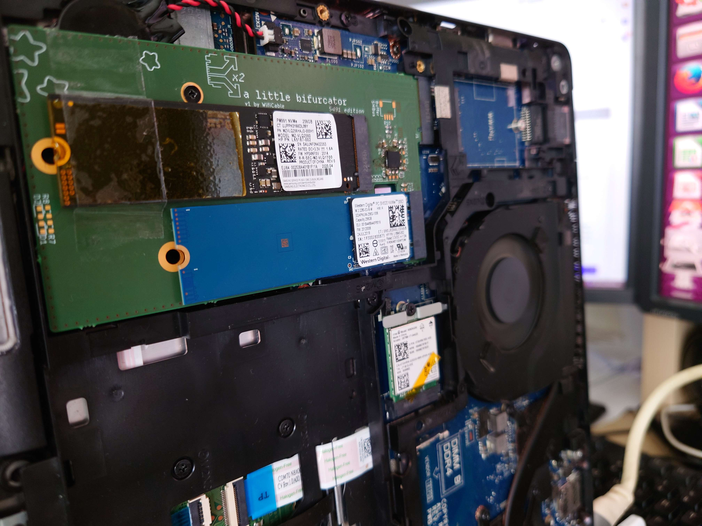
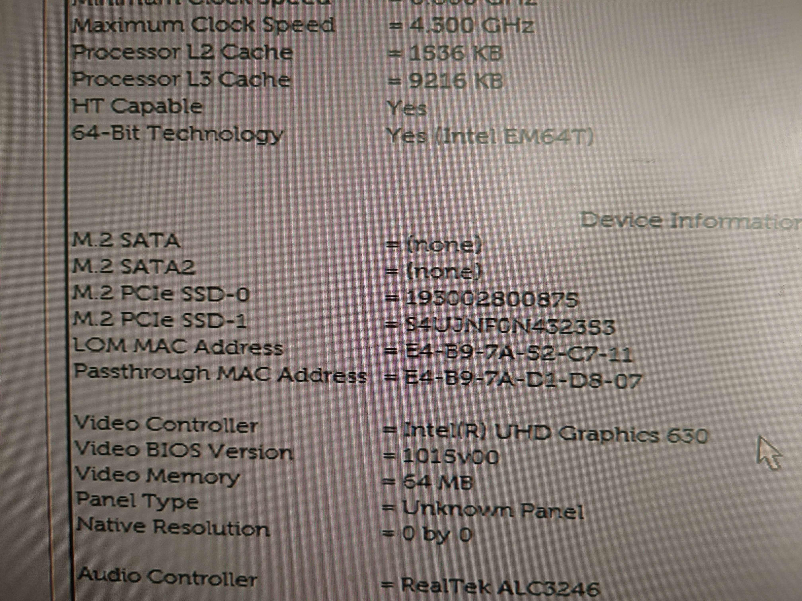
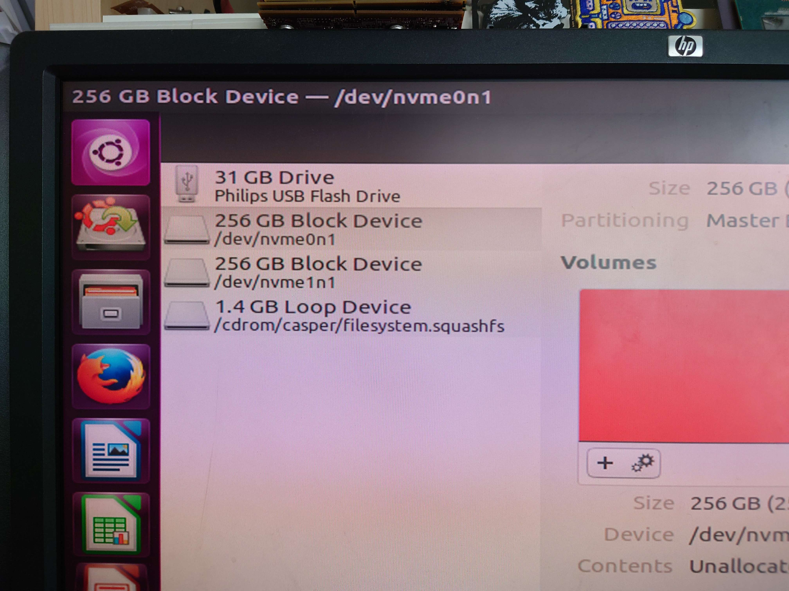
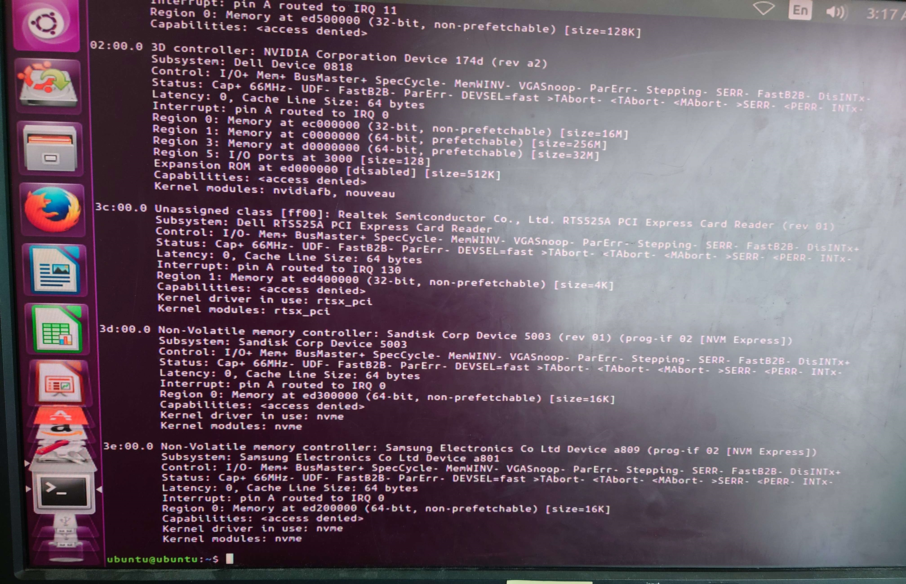
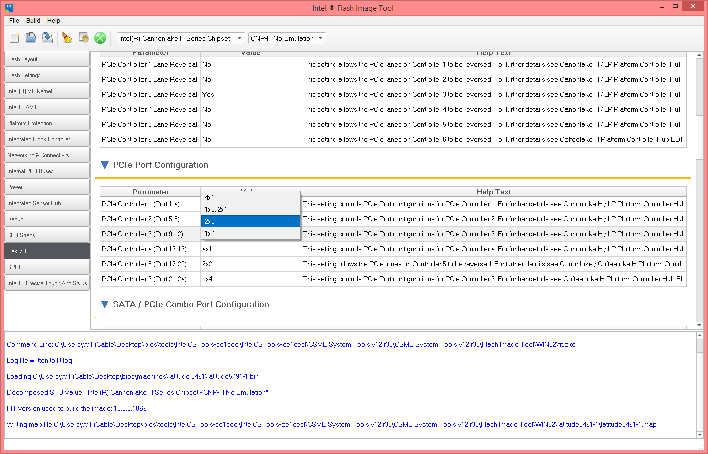

# Latitude 5491 SSD Expander
This project is a PCB meant to fit in the large empty space around the Dell Latitude 5491's M.2 SSD slot. Together with a firmware modification, it should allow me to fit 2 2280 NVMe SSDs with 2 PCIe lanes each.

This is also an experiment to figure out PCIe bifurcation in general. In this case I'm using a Renesas 9ZXL0651AKLF clock buffer with 6 outputs, but I'm only using the first 2 for this board.

Should in theory also work on the H-class CPU version of the Latitude 5480, but not the U-class 5480 and 5490, those only have 2 PCIe lanes for the SSD slot in the first place.

### pics:

> 
> 

> 
> 

# Results:

## It works!
> 

> Bifurcation board with 2 SSDs installed in a Latitude 5491

> 

> Both SSDs showing up in the setup menu (the second one is showing in the entry usually meant for the WWAN slot lol)

> 

> Both SSDs detected in Gnome Disks (Ubuntu 16.04 live)

> 

> Both SSDs showing up in lspci (not shown: both running at PCIe x2 as expected)

## How to make it work:

To get this working, you need to modify the Flex I/O configuration of your laptop by dumping the content of the BIOS chip, loading it into Intel's Flash Image Tool (mfit) (version 12.0.85.1919 for the Latitude 5491), navigating to the Flex I/O section and changing the PCIe Port Configuration for PCIe Controller 3 (Port 9-12) (this is the one connected to the M-key slot) from 1x4 to 2x2:

> 

> Changing the PCIe port from 1x4 to 2x2 in mfit

Then click the Build Image button at the top of the mfit window to generate a new bios binary file that can be flashed back onto the laptop (outimage.bin in the same directory as fit.exe)

For your first boot you might need to clear the cmos to get it to run and also give it a few reboot cycles. 

## I provide no warranty on any of this, I am not responsible if you mess up your machine  
This is only an experiment to prove it's possible for end users to bifurcate and generally change the configuration of the PCH PCIe lanes in their Intel-based laptop