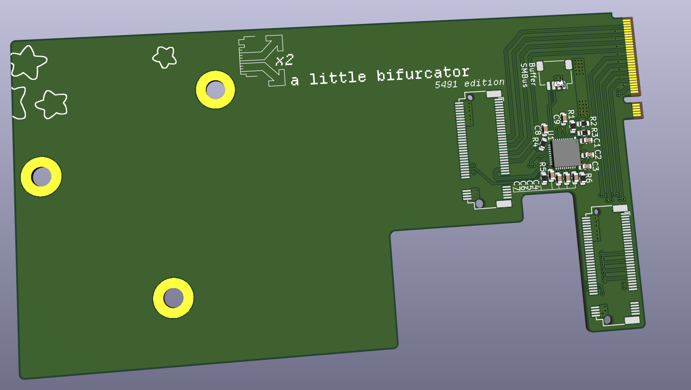
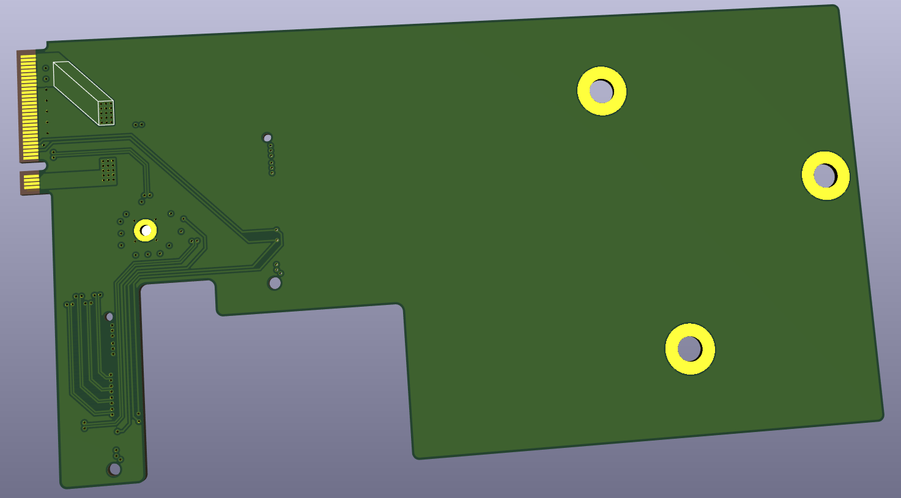
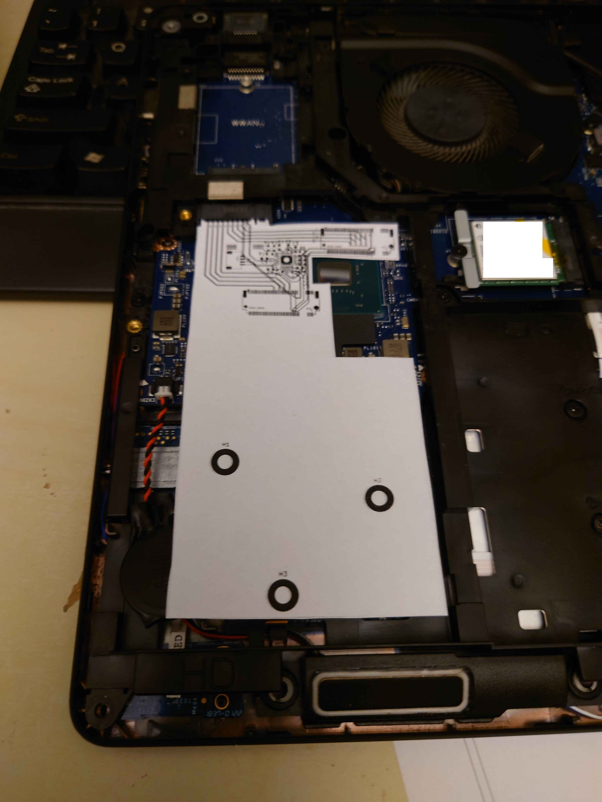
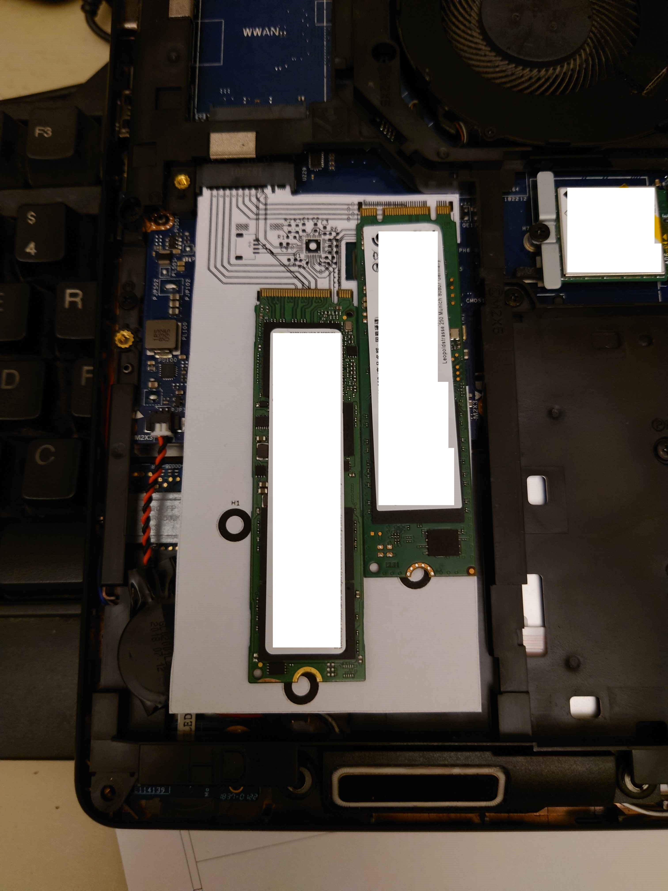

# Latitude 5491 SSD Expander
This project is a PCB meant to fit in the large empty space around the Dell Latitude 5491's M.2 SSD slot. Together with a firmware modification, it should allow me to fit 2 2280 NVMe SSDs with 2 PCIe lanes each.

This is also an experiment to figure out PCIe bifurcation in general. In this case I'm using a Renesas 9ZXL0651AKLF clock buffer with 6 outputs, but I'm only using the first 2 for this board.

Should in theory also work on the H-class CPU version of the Latitude 5480, but not the U-class 5480 and 5490, those only have 2 PCIe lanes for the SSD slot in the first place.

### pics:

> 
> 

> 
> 